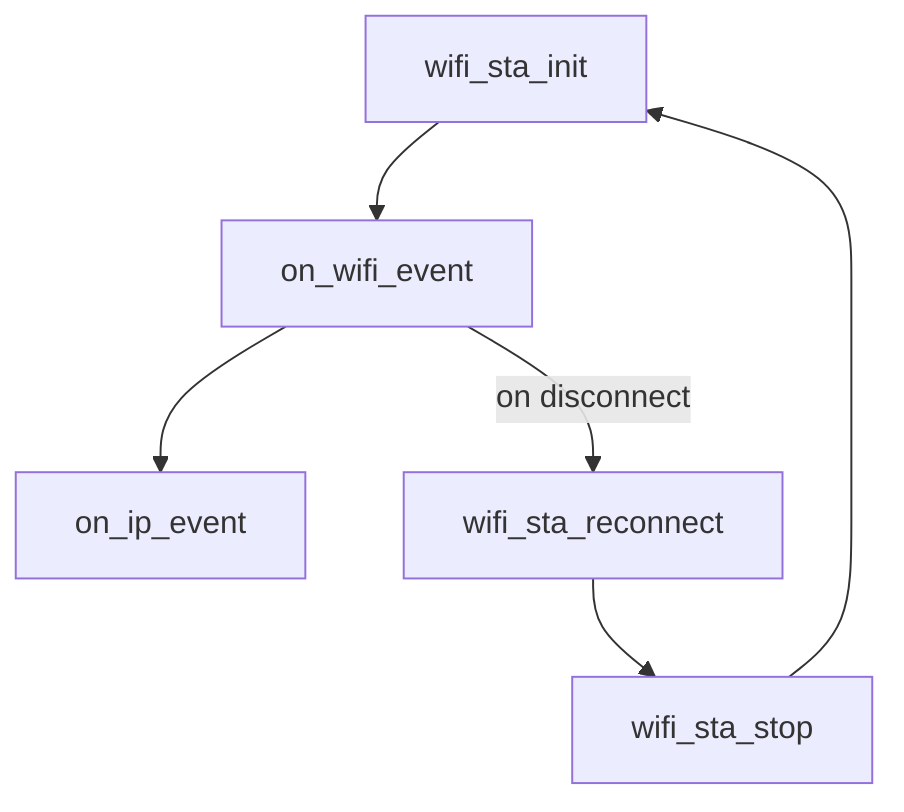

# ESP32 Wifi Driver Project

A custom WiFi driver implementation and configuration built on top of ESP-IDF for the ESP32 platform.


credit: Chat-GPT.

## Table of contents
- [Overall](#overall)
- [Components](#components)
- [Hardware Used](#hareware_used)
- [Software](#software)
- [Result](#result)
- [Mistake & fix](#mistake--fix)

## Overall

This project implements a WiFi connectivity module on the ESP32 using the ESP-IDF framework. It handles station mode connection, event network state management and IP process. Additionally, this project delves into low-level microcontroller concepts, using internal API of ESP manufacturer to handle every signal or event that occurs. 

By the way, to help me build this cool feature I need to reference Shawn Hymel's Youtube channel, which helped me a lot during implementation. I strongly recommend visiting his channel, trust me it's worth checking.

To begin with, Wifi [DRIVER](DRIVER.md) help with processing number of task event, such as scanning available networks, establishing a connection, handling disconnection/reconnection, and forwarding data between the application layer and the underlying hardware. The driver also works closely with the ESP-IDF event loop, which notifies the application whenever a change in WiFi or IP state happens — for example, when the device successfully connects, loses connection, or receives a new IP address.

Beyond just connecting to WiFi, this project aims to give a clearer picture of what actually happens under the hood: how the ESP32 negotiates with an access point, how packets are queued and processed, and how the driver abstracts away the complexity of the 802.11 protocol so the application code stays simple and readable.

By working through this project, the goal is not only to get a stable WiFi connection working, but also to build a solid understanding of embedded networking concepts that can be reused in future projects — whether that's IoT devices, sensor networks, or anything else that needs reliable wireless communication.

---

## Components

The `wifi_sta` component exposes **3 core public functions**, each handling one stage of the WiFi station lifecycle:

| Function | Responsibility |
|---|---|
| `wifi_sta_init()` | Creates the netif and WiFi driver, registers WiFi/IP event handlers, applies configuration from `Kconfig`, and starts WiFi |
| `wifi_sta_stop()` | Unregisters event handlers, disconnects, stops and deinitializes WiFi, and destroys the netif/driver |
| `wifi_sta_reconnect()` | Calls `wifi_sta_stop()` followed by `wifi_sta_init()` to fully reset the connection |

Internally, two static event handlers drive the actual state machine:

- `on_wifi_event()` — reacts to `WIFI_EVENT_STA_START` / `CONNECTED` / `DISCONNECTED` / `STOP`, and triggers auto-reconnect when enabled
- `on_ip_event()` — reacts to `IP_EVENT_STA_GOT_IP` / `GOT_IP6` / `LOST_IP`, and logs the assigned IP address



---

## Hardware

- **Board:** ESP32-DevKitV1

---

## Software

- **Framework:** ESP-IDF v5.4
- **Build system:** CMake + `idf.py`
- **Language:** C
- **Config:** WiFi SSID/password and behavior (auth mode, auto-reconnect, IPv4/IPv6) are configured via `Kconfig` under `Wifi STA Configuration` in `idf.py menuconfig`

---

---

** CMake

Each part of the project has its own `CMakeLists.txt`, following the standard ESP-IDF component structure:

| File | Role |
|---|---|
| `CMakeLists.txt` (project root) | Registers the ESP-IDF project, includes `apps/wifi_demo` as the build target |
| `apps/wifi_demo/main/CMakeLists.txt` | Registers `main.c` as the application entry point |
| `components/wifi_sta/CMakeLists.txt` | Registers the `wifi_sta` component: source files, public include directory, and dependencies |

Component-level `CMakeLists.txt` example:

```cmake
idf_component_register(
    SRCS "wifi_sta.c"
    INCLUDE_DIRS "include"
    REQUIRES esp_wifi esp_event esp_netif nvs_flash
)
```

- `SRCS` — source files compiled into this component (`wifi_sta.c`)
- `INCLUDE_DIRS` — exposes `include/wifi_sta.h` as the public API for other components/apps
- `REQUIRES` — explicit dependencies on ESP-IDF's built-in components (WiFi, event loop, netif, NVS)

This isolates the WiFi driver into a self-contained, reusable component instead of coupling it directly into `main.c`.

---

** Kconfig

The `wifi_sta` component defines its own `Kconfig`, which adds a **"Wifi STA Configuration"** menu inside `idf.py menuconfig`. This allows WiFi credentials and connection behavior to be configured per build, without hardcoding values in the source code.

Run:

```bash
idf.py menuconfig
```

Then navigate to `Component config` → `Wifi STA Configuration`, where the following options are available:

| Option | Description |
|---|---|
| Connect using wifi | Enables/disables WiFi connection at build time |
| Internet Protocol (IP) version | Selects IPv4 / IPv6 support |
| Minimum Wifi authentication mode | Minimum accepted auth mode (e.g. WPA/WPA2 PSK) |
| WIFI SSID | Network name to connect to |
| Wifi password | Network password |
| SAE mode for WPA3 | Password identifier for SAE H2E (WPA3 support) |
| Automatically reconnect on disconnect | Enables auto-reconnect logic in `on_wifi_event()` |

This mirrors the same pattern ESP-IDF itself uses internally — keeping configuration decoupled from application logic, so credentials and behavior can change without touching `wifi_sta.c`.


---

---

## Result

The project builds, flashes, and connects successfully. Below is the verified boot and connection log f


---

## Mistake & Fix

| # | Mistake | Fix |
|---|---|---|
| 1 | Used internal ESP-IDF WiFi APIs (e.g. `esp_wifi_create_if_driver`, `esp_wifi_internal_reg_netstack_buf_cb`, `esp_wifi_internal_get_sta_ip`) that are not part of the public API — these were modified/relocated in the latest ESP-IDF release, causing build errors (`undefined reference` / missing header) | Had to include the older internal headers directly (e.g. `esp_wifi_netif.h`, `esp_wifi_internal.h`) to access these functions, since the newer ESP-IDF version no longer exposes them the same way. Pinned the project to a compatible ESP-IDF version (v5.4) to avoid further internal API breakage |
| 2 | `spi_flash: Detected size(4096k) larger than the size in the binary image header(2048k)` — flash size in `sdkconfig` didn't match the actual chip | Went to `idf.py menuconfig` → `Serial flasher config` → `Flash size`, corrected it to the actual 4MB flash |

> **Note:** relying on ESP-IDF's *internal* (non-public) WiFi APIs makes this driver tightly coupled to a specific ESP-IDF version. If ESP-IDF is upgraded in the future, these internal headers/functions may move or change signature again, requiring the same fix to be reapplied.

---


